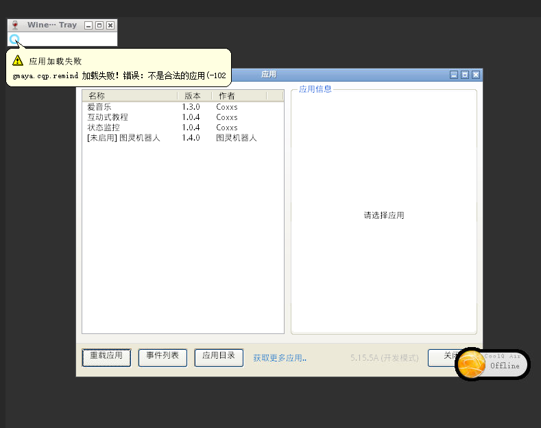
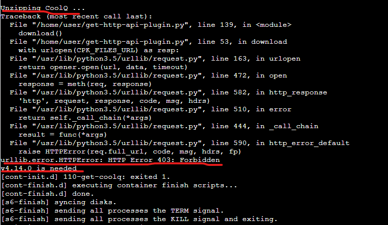
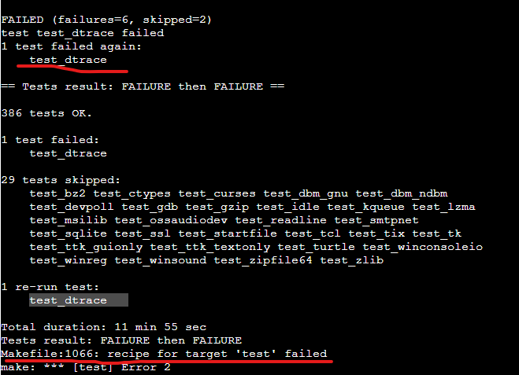
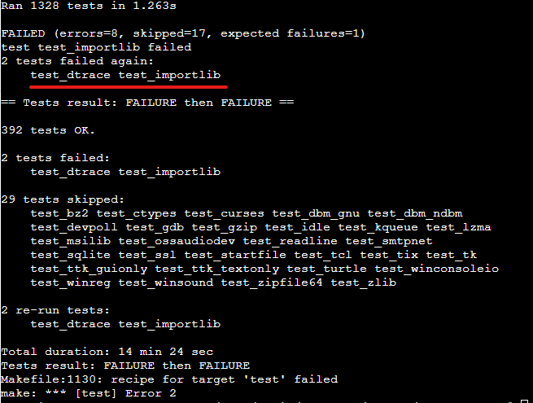
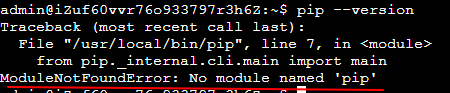
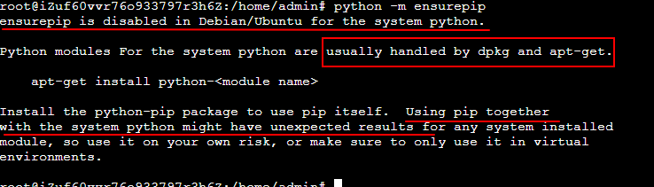
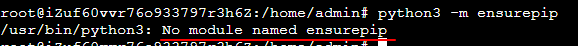
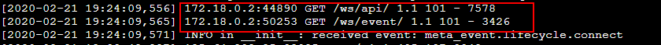
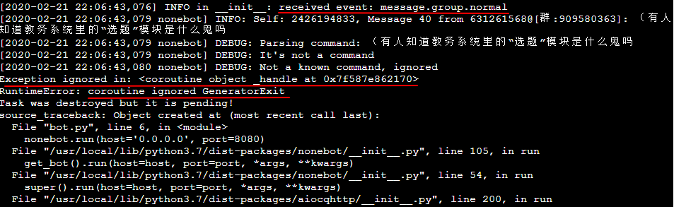

# 工作记录

## 目录
<!-- @import "[TOC]" {cmd="toc" depthFrom=1 depthTo=6 orderedList=false} -->

<!-- code_chunk_output -->

- [工作记录](#工作记录)
  - [目录](#目录)
  - [记录](#记录)
    - [20200217](#20200217)
      - [打包发布](#打包发布)
      - [尝试上云](#尝试上云)
      - [下一步工作](#下一步工作)
    - [20200218](#20200218)
      - [尝试上云](#尝试上云-1)
      - [下一步工作](#下一步工作-1)
    - [20200219](#20200219)
      - [尝试上云](#尝试上云-2)
      - [下一步工作](#下一步工作-2)
    - [20200220](#20200220)
      - [安装 NoneBot](#安装-nonebot)
      - [下一步工作](#下一步工作-3)
    - [20200221](#20200221)
      - [使用 NoneBot](#使用-nonebot)
      - [下一步工作](#下一步工作-4)

<!-- /code_chunk_output -->

## 记录

### 20200217

#### 打包发布

1. 在工程中的 `app_id.txt` 中更改 `appid`
2. 同时将文件夹`com.example.demo`的名称改为设置的 `appid`
3. 在coolq中进行打包
4. 在文件夹中可找到对应 cpk 文件

#### 尝试上云

1. 阿里云服务器租用
    * ￥9.5/month
    * Ubuntu 18.04

2. 主要原理
    * 使用 coolq 的 [cpp sdk](https://github.com/cqmoe/cqcppsdk)进行开发
        * [文档](https://cqcppsdk.cqp.moe/)
    * coolq 原生 windows 平台运行
    * 在 Ubuntu 中使用 Docker 容器运行 coolq
        * [Docker](https://yeasy.gitbooks.io/docker_practice/content/) 是一个 `容器`
        * docker.io 版本比较老
        * docker-ce 为最新安装方式

3. 在服务器中部署 ftp 以方便文件管理
    * 服务器端使用 [vsFTPd](https://www.jianshu.com/p/c8947a59c96a)
    * 本地使用 FileZilla

4. coolq 在 Docker中可以运行，但原生 “爱音乐” app不可正常运行，所有上传的 .cpk 文件无法正常加载
    * docker.io 与 docker-ce 均无法正常运行

#### 下一步工作

1. 与nxp交流，得知 [包含httpAPI的docker](https://github.com/richardchien/cqhttp-docker) 不报错，可以进行尝试

2. 考虑 [httpAPI 插件的 Docker](https://cqhttp.cc/docs/4.14/#/Docker) 适配问题
    * 确认是否是少了什么适配
    * 怀疑问题所在：

    >注意如果 酷Q 启动时报错说插件加载失败，或者系统弹窗提示缺少 DLL 文件，则需要安装 Visual C++ 可再发行软件包（点击链接即可从官方下载，如果自行安装，一定要装 x86 也就是 32 位版本！），如果你的系统是 Windows 7 或 Windows Server 2008、或者安装 Visual C++ 可再发行软件包之后仍然加载失败，则还需要安装 通用 C 运行库更新，在这个链接里选择你系统对应的版本下载安装即可。如果此时还加载失败，请尝试重启系统。
    
    * [来源](https://cqhttp.cc/docs/4.14/#/?id=%E6%89%8B%E5%8A%A8%E5%AE%89%E8%A3%85)

3. 完成“定时响应”功能
    * 确认当前时间
    * 存储事件方式
        * 测试是否支持json

### 20200218

#### 尝试上云

* 尝试修改 cpk 包的打包方式，但仍不能运行

* 尝试使用 [包含httpAPI的docker](https://github.com/richardchien/cqhttp-docker)
    * pull正常，但启动时报错
    
    * Docker 无法运行
    * 错误应该发生在下载/解压 CoolQ 时
    
* 尝试使用 [httpAPI 插件的 Docker](https://cqhttp.cc/docs/4.14/#/Docker) 
    * pull 成功
        * 主要区别在于 pull 了 latest 标签的镜像
    * 原生 “爱音乐” app 无法正常运行
    * **仍然-102错误**

#### 下一步工作

1. 与nxp交流，得知[他的配置方法](https://github.com/dwxrycb123/AkinaChann)
    * 完全卸载 docker，从头开始安装
    * 考虑再次按官方文档/[包含httpAPI的docker](https://github.com/richardchien/cqhttp-docker)/ [httpAPI 插件的 Docker](https://cqhttp.cc/docs/4.14/#/Docker) 进行配置

2. 若不行，考虑Windows Server

3. 完成“定时响应”功能
    * 确认当前时间
    * 存储事件方式
        * 测试是否支持json

4. 使用终端客户端连接服务器

### 20200219

#### 尝试上云

* 使用[nxp的配置方法](https://github.com/dwxrycb123/AkinaChann)
    * 失败
    * 考虑查找文档
    * 考虑使用httpAPI直接调用

* 尝试使用httpAPI
    * 本机使用测试成功
        * Chrome 输入 "http://127.0.0.1:5700/send_private_msg?user_id=631261568&message=hello!"
    * 了解基于httpAPI的 python SDK
        * [NoneBot](https://github.com/richardchien/nonebot) / [aiocqhttp](https://github.com/cqmoe/python-aiocqhttp)
        * 选择 NoneBot 
            * NoneBot 基于 aiocqhttp
    * 更新 python
        由于 NoneBot 只支持 Python 3.6 以上版本，故必须进行更新
        * 下载、解压、make
        * 在 `make test` 时发生错误
            
            * 尝试重新下载
        * 下载 Python 3.8.1
            * 同样失败
            
        * [使用 ppa 源及 apt 命令安装](https://cloud.tencent.com/developer/article/1559355)成功
            * 版本选择了 Python 3.7
        * [更新 Python 默认指向](https://blog.csdn.net/u014775723/article/details/85213793)
            * 直接将 python 命令指向 Python 3.7
            * 注意由于安装方式和此网页所述不同，命令中软链接地址需要修改，与网页直接提供的略有差别

#### 下一步工作

1. 继续安装 NoneBot 
    * 安装
    * 尝试进行调用

2. 熟悉 Python 的 SDK
    * 发送消息
    * 接收处理消息
    * 测试对 json 的支持

3. 插件功能
    1. 定时发送消息
    2. 使用消息触发定时
    3. 使用消息为他人定时

### 20200220

#### 安装 NoneBot

* pip 安装后报错
    
    * 原因未明
    * [尝试解决](https://blog.csdn.net/haihonga/article/details/100168691)
        * 执行语句 `python -m ensurepip`
            * 再次报错
                
            * 考虑强制执行
        * 执行语句 `python3 -m ensurepip`
            * 报错
                
            * **此错误提示难以搜索到解决方案**
    * ==此问题解决==
        * 问题的原因是 pip 未升级到最新版本
            * 自动下载的版本为 8.x.x 现在使用的版本为 20.x.x
            * 昨天第一次使用 pip 时报版本过低，需要升级；今天使用时未直接报此错误
        * pip [升级](https://www.cnblogs.com/huxiangyang/p/10617919.html) 后运行正常

* 成功使用 pip 安装 NoneBot
* 可以运行

#### 下一步工作

1. 测试 NoneBot 与 httpAPI 的连接情况
    * 重新启动 Docker 中的镜像
    * bot.py 的事件上报中考虑监听所有端口

2. 尝试使用 Python 的 API

3. 插件功能
    1. 定时发送消息
    2. 使用消息触发定时
    3. 使用消息为他人定时
    3. 回复确认是否发送了健康报告

### 20200221

#### 使用 NoneBot

* 更改 HttpAPI 配置文件，将 `172.18.0.1:8080` 写入 `post_url` 中，重启插件，NoneBot 连接成功，获得事件上报
    
    * 此 log 表示插件、NoneBot均可运行

* 使用命令 `/echo 你好，世界` 私聊测试bot，无回复，无上报
    * 在群里发送消息，获得上报
        * 同时发生错误
        
        * 从 NoneBot 向 HttpAPI 传送消息的途径不确定打开
            * 可以通过消息发送命令进行测试
    * 私聊消息为何未获得上报？

#### 下一步工作

1. 命令的上下行通讯测试
    * 私聊的事件报告
    * 使用 NoneBot 发送私聊、群聊消息

2. 插件功能
    1. 定时发送消息
    2. 使用消息触发定时
    3. 使用消息为他人定时
    3. 回复确认是否发送了健康报告